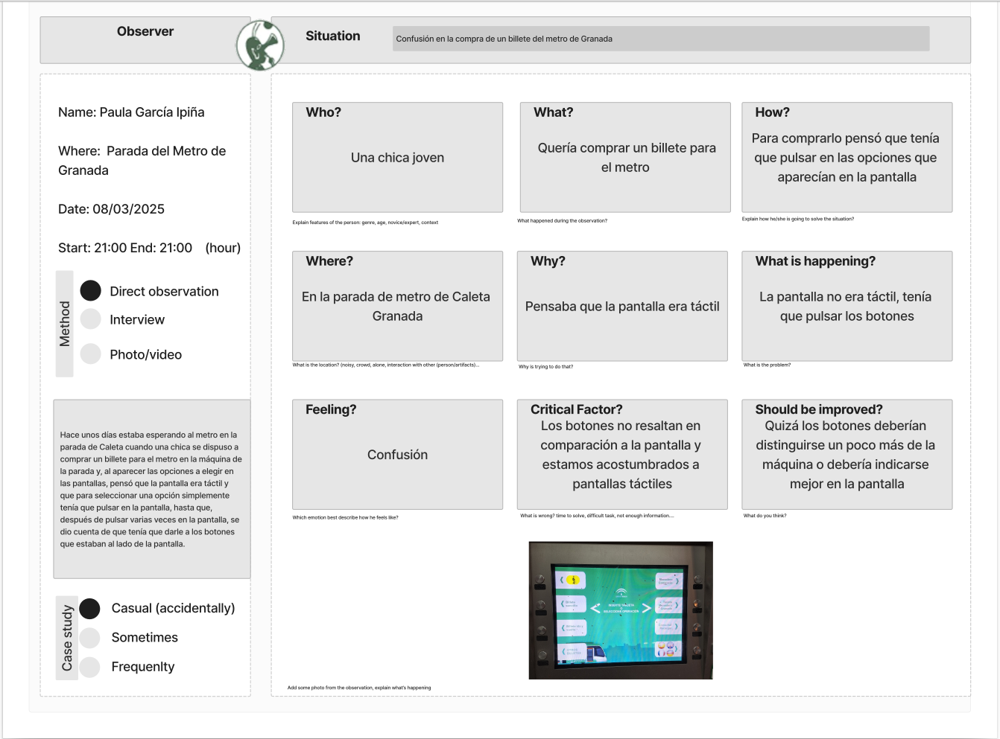
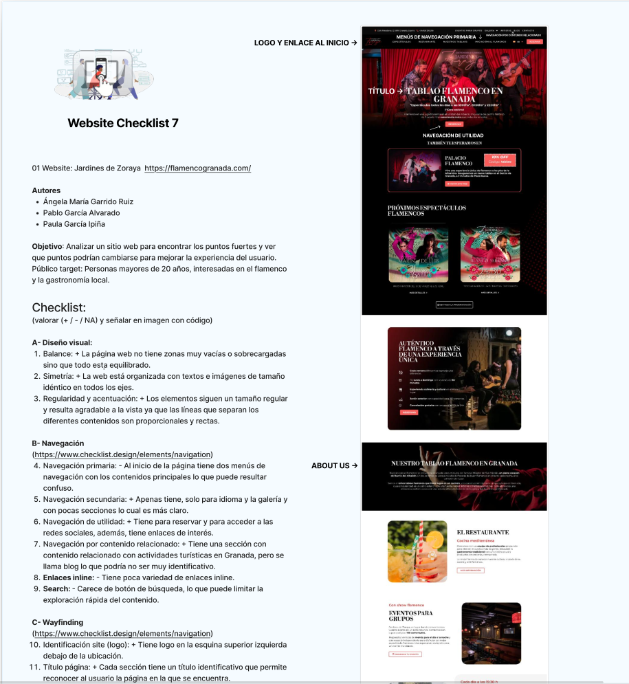
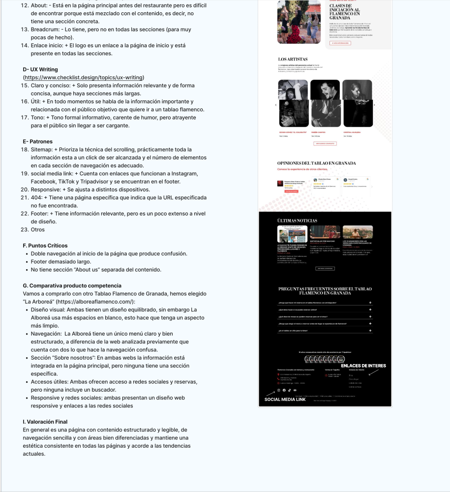
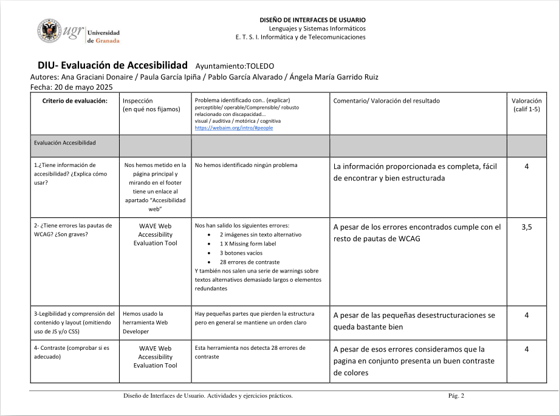
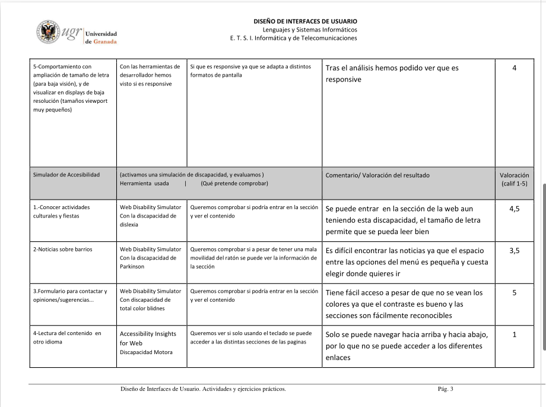
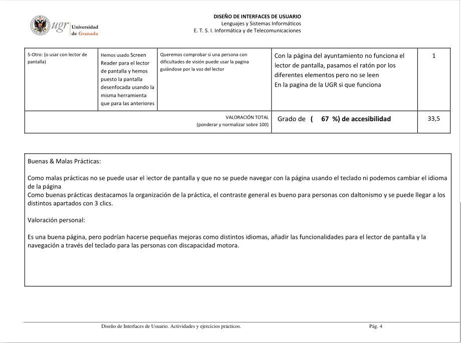
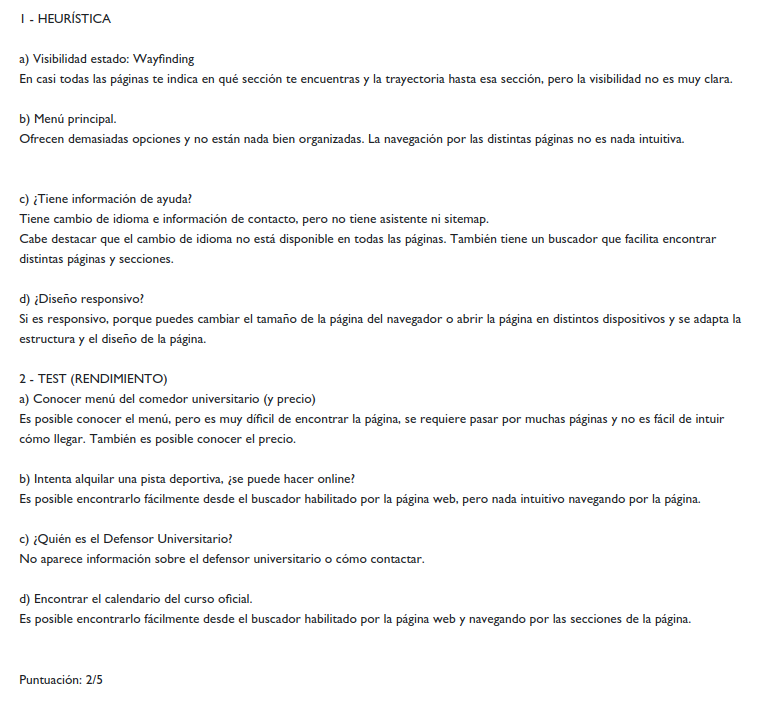
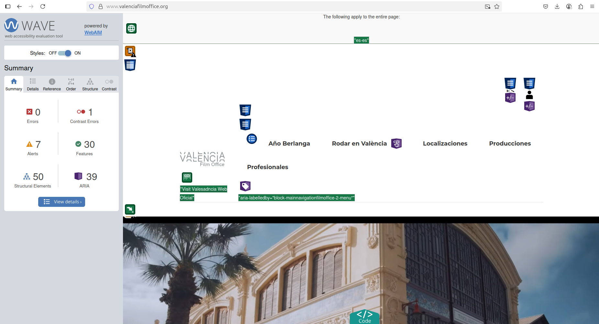
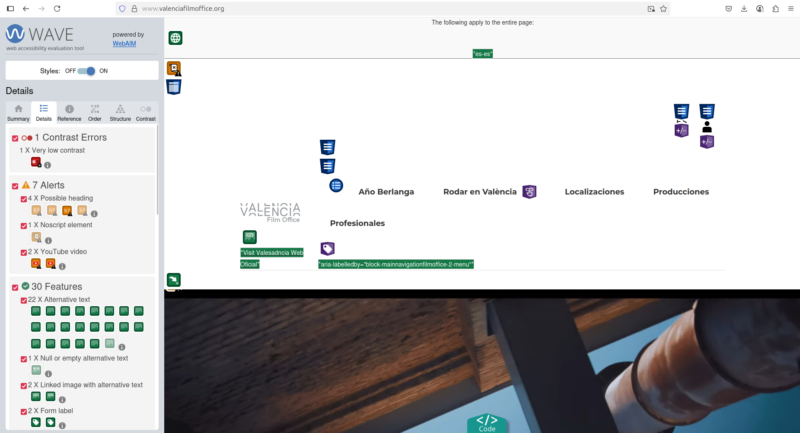

# DIU_TrabajoFinal
Realizado por: Paula García Ipiña.

# PARTE I: MI EXPERIENCIA UX
 
Mi experiencia en el análisis de experiencias de usuarios y diseño de interfaces, aunque breve, es bastante completa al haber tocado múltiples y diversos aspectos en la asignatura. A lo largo de estos últimos meses, he realizado diversas actividades que van desde analizar el comportamiento de las personas para observar sus dificultades y entender sus necesidades, hasta análisis de diversos aspectos importantes de una interfaz que afectan a la experiencia de usuario, pasando por el diseño de interfaces creativas o, incluso, desarrollando, a lo largo de todas las prácticas, un caso de estudio completo junto con una propuesta de mejora y de diseño de interfaz.
Todas estas actividades y prácticas, así como la experiencia que me han aportado, son las siguientes:
 

## Actividad I: Etnografía.
En esta primera toma de contacto, se partía del aspecto más básico del análisis de la experiencia de usuario: observar situaciones reales de usuarios teniendo conflictos a la hora de interaccionar con una interfaz. 
En este caso, hacíamos uso de un método de análisis **cualitativo** (observación directa) donde ponemos el enfoque en el **comportamiento de los usuarios** (frente a “lo que los usuarios dicen”), **sin ninguna intervención** por nuestra parte (analizando el uso natural del producto), sino simplemente actuando como observadores.
En mi caso, la situación que observé es una que se da de forma frecuente: confusión de los usuarios para entender la compra de billetes del transporte público, en este caso del metropolitano de Granada. El estudio que hice fue el siguiente:  

 
De esta forma, las aportaciones principales fueron:
- **Identificar y recoger el conflicto observado:** una chica joven vive una confusión para usar una interfaz de compra de billetes de tranvía.
- **Detectar el problema de uso con el producto:** piensa que es una pantalla táctil y tarda en darse cuenta de que debe pulsar los botones.
- **Concluir cuál es el problema de diseño:** no se hace suficiente énfasis en que no es una pantalla táctil sino que se deben pulsar los botones, y éstos no se distinguen lo suficiente.
 

## Actividad II: Evaluación de un diseño web.
En esta segunda actividad, se cambiaban las tornas y éramos nosotros los que interactuábamos directamente con la interfaz puesta a estudio, que en este caso era una página web.
El método seguido, a diferencia de la actividad anterior, no consistía en un uso natural de la interfaz, sino en un análisis guionizado siguiendo una plantilla de tipo _Checklist_ donde observábamos si la página puesta a estudio cumplía con las diferentes pautas relacionados con un buen diseño web, que faciliten la experiencia de usuario al público objetivo, para finalmente comparar la propuesta con otros productos de la competencia.
La página a analizar fue la de **Jardines de Zoraya** (https://flamencogranada.com) y la propuesta de la competencia elegida para la comparativa fue “La Arboreá” (https://alboreaflamenco.com). Las pautas a analizar fueron: diseño visual, navegación, wayfinding, UX Writing, patrones y puntos críticos.
 

 
 

 
Las aportaciones fueron:
- **Seguimiento de las distintas pautas de buen diseño web y usabilidad** aplicadas a un escenario real y su búsqueda y análisis en la página de estudio.
- **Detectar problemas clave que incumplen las pautas y afectan a la usabilidad**, como una estructura de sitio mejorable con secciones no claras o fáciles de encontrar, una navegación inconsistente y confusa (doble menú de navegación con elementos que cambian) o la falta de un buscador.
- **Comparativa con una página similar para destacar puntos de mejora**, como el equilibrado del diseño web (mejor en la competencia), o la navegación (principal punto defectuoso en nuestra página de estudio, mucho mejor en la competencia).
 

## Actividad III: Moodboard.
En esta tercera actividad, se pasaba del análisis y la observación a dar los primeros pasos del diseño de interfaces. Ese primer paso dado en esta actividad consiste en, a partir de una idea de proyecto, **crear una guía de estilos adecuada y coherente con el proyecto**, que se recoge en un tablero de inspiración, o moodboard. En este tablero de inspiración se perfilan ideas y estilos para definir las **pautas principales del diseño visual**.
En esta actividad, las pautas recogidas, así como las herramientas de diseño empleadas para su creación, han sido:
- **Idea de proyecto y estrategia de marca.** La propuesta planteada por nuestro grupo de trabajo fue la de un espacio cultural de encuentro de amigos que mezcle cine y moda.
- **Imagotipo:** representación gráfica de la marca. Hecha con la herramienta:   https://www.designevo.com.
- **UX Writing:** ideado por el grupo de trabajo.
- **Paleta de colores:** seleccionada con la página https://coolors.com.
- **Tipografía:** tipografías seleccionadas combinando las herramientas: https://fontjoy.com/ y https://designs.ai/fonts/.
- **Imágenes.**
- **Inspiración de diseño:** seleccionadas desde https://www.designspiration.com/.
- **Inspiración de usuarios:** propuestos por el grupo de trabajo pensando en las emociones que se quieren transmitir.

Finalmente, el tablero creado fue el siguiente:
 

 

Las aportaciones fueron:
- **Propuesta en grupo del proyecto**, el tipo de espacio que se quiere crear.
- **Ideación y definición**, siguiendo los principios del diseño, de las pautas principales del diseño visual que consideramos adecuado para el proyecto creado.
- **Conexión** de las pautas de diseño propuestas con la inspiración tanto visual de diseño como emocional de usuarios.

## Actividad IV: Accesibilidad
Con esta actividad, volvemos al análisis de interfaces, más específicamente, al **análisis de usabilidad de una página web**. Comprobaremos si una página web cumple con las propuestas de accesibilidad, que permiten que las páginas sean usables por personas con diversas discapacidades. Para ello, usaremos dos métodos de análisis:
- **Inspección e identificación de potenciales problemas de accesibilidad**, partiendo de una lista de criterios a evaluar, haciendo uso (o no) de diversas herramientas automáticas de verificación.
- **Usando un simulador de discapacidad**, que nos permite experimentar lo que sienten las personas con diferentes tipos de discapacidad, y lo aplicaremos en la página a estudio para comprobar cómo es la percepción y el uso de la página cuando se tiene alguna discapacidad.

La página web que analizamos en nuestro estudio de accesibilidad fue la página web de Toledo y el resultado del estudio que llevamos a cabo fue:
 

 

 

 

Las aportaciones principales a este estudio fueron:
- **Inspección de diversos criterios de evaluación** en la página web sometida a estudio, empleando diversas herramientas de evaluación de accesibilidad como la WAVE Web Accesibility Evaluation Tool (http://wave.webaim.org), la extensión de Google Chrome Web Developer.
- **Detección y explicación de los problemas encontrados y valoración de los resultados obtenidos** con las herramientas de evaluación, según si la página cumplía los criterios en mayor o menor medida y si se encontraban muchos, pocos o ningún problema.
- **Empleo de la herramienta de simulación de discapacidades Web Disability Simulator y la herramienta de lectura de pantalla Screen Reader**, con las cuales evaluamos y experimentamos en primera persona cómo de difícil era llevar a cabo diversas metas comunes en páginas de ayuntamientos con diversas discapacidades y recogiendo las dificultades que nos encontrábamos.
- **Valoración del resultado obtenido con los simuladores de discapacidad** en las diversas metas propuestas, cada una llevada a cabo con una discapacidad distinta.
- **Prueba y evaluación del funcionamiento del lector de pantalla.**
- **Reflexión sobre las buenas y malas prácticas** de la página puesta a estudio en cuanto a accesibilidad, y realización de una **valoración final con propuestas de mejora**.
 

## Actividad V: Web Animation Design
En esta actividad se vuelve al diseño de interfaces, esta vez **interfaces dinámicas**, realizando un **diseño de una página web con micro interacciones y animaciones**. Con esta actividad se busca ofrecer una experiencia de usuario que impacte visual y funcionalmente.
Para el desarrollo de la actividad, elegimos una **animación de tipo Intro Slider** e, inspirándonos en el ejemplo dado (https://www.display.care/resources/), hicimos uso de Figma para la realización de una propuesta de rediseño con nuestro propio concepto de frutos del bosque. Nuestra estrategia era la combinación de colores que recuerdan a los frutos del bosque con transiciones suaves para representar naturalidad y dinamismo.
El proyecto final se encuentra en:
[Web Animation Design](https://www.figma.com/design/8QQhJQCKxNQlAI6gn3r8fl/DesignAnimation-3-Slider?node-id=2053-2)

Las aportaciones de este proyecto fueron:
- **Diseño y personalización de transiciones y microinteracciones** entre diferentes elementos de un prototipo de página web en Figma que hacen al usuario partícipe de los efectos visuales mediante movimientos del cursor o clics.
- **Diseño de una animación que genere un impacto** que mejore la experiencia de usuario y atraiga su atención hacia nuestros productos, y mejore su valoración sobre nuestro proyecto.
- **Creación de una conexión** entre diversos aspectos como diseño visual, usabilidad y experiencia de usuario.
 

## Actividad extra: Usabilidad
En esta actividad llevamos a cabo la realización de un informe de usabilidad de una página web de una universidad. Para ello, empleamos dos métodos de evaluación: inspección mediante heurística, que consiste en la revisión por expertos (nosotros con nuestra experiencia) del cumplimiento de una serie de puntos; y el testeo de la página mediante la propuesta de una serie de metas a realizar en la página, y cómo de fácil/difícil es llevarlas a cabo.
La evaluación de la usabilidad la llevamos a cabo con la página de la Universidad de las Islas Baleares (https://www.uib.es). El informe obtenido fue el siguiente:
 

 

Las aportaciones realizadas en la actividad fueron:
- **Emplear la técnica de evaluación heurística** para inspeccionar la adecuación de una página web a una serie de estándares de usabilidad, como son: wayfinding, análisis de la navegación principal, información de ayuda y diseño responsivo. Para ello, hicimos nosotros como expertos la examinación de la página web, y valoramos su adecuación a los principios mencionados.
- **Emplear la técnica de testeo de usabilidad**, llevando a cabo un análisis mediante pruebas dirigidas. Es decir, como usuarios normales de la página, llevamos a cabo una serie de tareas comunes en la página, valorando la dificultad o claridad con que pudimos realizarlas.
- **La combinación de ambas técnicas nos permitió identificar múltiples problemas críticos en la experiencia de usuario**, tanto desde el punto de vista de un experto como de un usuario, obteniendo una visión más completa de la usabilidad de la página.
 

## PRÁCTICAS. Análisis de un caso de uso y propuesta de rediseño
A lo largo de la realización de las prácticas, se ha llevado a cabo un **caso de estudio UX completo**, consistente en dos partes principales: un **análisis de usabilidad de un local con la temática propuesta** (gastronomía/ocio de degustación), en nuestro caso elegimos el local granadino _Carlota Braun_; para posteriormente, en una segunda parte, partiendo de los resultados de los estudios llevados a cabo con el local anterior, **crear una propuesta de rediseño**, transformando el proyecto analizado en un nuevo local innovador y creativo, llamado _**El Rincón de Gurb**_.
Para llevar a cabo este caso de estudio UX, en el contexto del análisis de usabilidad, se han empleado una amplia variedad de métodos de investigación, desde análisis cualitativos a análisis cuantitativos, métodos de investigación actitudinales vs comportamentales, haciendo uso de diversas herramientas / plantillas de evaluación. Posteriormente, se ha seguido un proceso de diseño incremental, partiendo de la ideación del proyecto y una propuesta de valor, siguiendo por el diseño de las guías de estilo, así como el desarrollo de bocetos o mockups del nuevo proyecto y su diseño final con Figma, hasta finalmente el análisis de usabilidad y testeo del proyecto finalizado.
Las aportaciones que todos estos métodos / herramientas han tenido hacia mi experiencia en usabilidad y experiencia de usuario son las siguientes:

## Paso 1: Investigación y análisis de la experiencia de usuario
 

### 1a. User Research Plan
Si bien, por limitaciones de recursos y tiempo, no era posible llevar a cabo una investigación de usuarios real, hicimos una simulación de usuarios pensando en perfiles diferenciados que encajasen con nuestro local, para lo cual nos basamos en nuestro entorno y en nuestra experiencia visitando estos locales, por lo que podría encajar dentro del método de observación. En cualquier caso, fue nuestra primera toma de contacto con la ideación de personas y la empatía hacia los usuarios que puede tener nuestro proyecto.
 

### 1b. Competitive Analysis
El análisis comparativo con la competencia nos permitió identificar aquellos puntos fuertes y destacables de nuestro caso de estudio, así como las áreas de mejora respecto al rediseño. Esta técnica nos permitió entender cómo las estrategias de diseño de la competencia pueden hacer resaltar fallos que puedan pasar desapercibidos de lo contrario, además de inspirar mejoras en nuestros proyectos.
 

### 1c. Personas
El diseño de perfiles representativos de usuarios reales de nuestro caso de estudio es un método ampliamente utilizado que permite pensar en términos de personas reales y sus posibles necesidades / deseos, y en qué problemas concretos pueden tener a la hora de usar nuestra propuesta.
 

### 1d. User Journey Map
La representación de User Journey Map nos permitió descubrir aquellos puntos de fricción claves para detectar las oportunidades de mejora de la experiencia de los usuarios.
 

### 1e. Usability Review
La Usability Review es una herramienta de evaluación sistemática de la página según criterios de usabilidad muy completa, que me permitió entender cuáles son los principios de usabilidad claves que definen la calidad de una interfaz, y cómo estructurarlos para poder llevar a cabo una correcta evaluación.
 

## Paso 2: UX Design.
 

### 2a. Ideación: feedback capture grid y empathy map.
Los feedback capture grid nos permitieron identificar fortalezas, debilidades, cuestiones sin resolver y oportunidades de mejora, a partir de las conclusiones sacadas con las técnicas anteriores. Este proceso permite entender cómo transformar aquellos problemas detectados o cuestiones planteadas en ideas de diseño concretas que puedan ser aplicables en un rediseño/nueva propuesta.
Los empathy mapping, por otro lado, permiten entender de forma más clara la diferenciación entre aquello que los usuarios piensan y sienten frente a aquello que dicen y hacen, además de analizar su entorno (aquello que ven/oyen) y, en conjunto con sus dificultades y sus metas, para tener una comprensión más profunda de cómo solucionar aquello que los usuarios necesitan y cómo transformarlo en mejoras para la experiencia de usuario de nuestro proyecto.
 

### 2b. Propuesta de valor (Scope Canvas)
A partir de los resultados obtenidos con los métodos anteriores, aprendemos a realizar una propuesta de valor donde reflejar el comienzo de nuestro rediseño, resumiendo los puntos a mejorar basándonos en las necesidades de los usuarios y los objetivos a cumplir, y aprendemos a definir un propósito para nuestro proyecto, así como las acciones a desarrollar y las métricas a considerar.
 

### 2c. Arquitectura de la información: user flow (task) analysis, sitemap + labelling.
La ideación de un sitemap, así como de los principales user flows (a la hora de realizar las principales tareas de nuestro proyecto), nos permite tener una primera toma de contacto con el desarrollo de una arquitectura de la información, organizando los contenidos de manera lógica, mejorando la experiencia de usabilidad y navegación de los usuarios.
 

### 2d. Wireframes.
El diseño de wireframes nos aportó una gran experiencia y aprendizaje de Figma, herramienta ampliamente usada en el diseño de interfaces, y nos aportó una primera toma de contacto con el diseño de layouts de una interfaz, experimentando con las potenciales interacciones de los usuarios, y comenzando a aplicar algunos principios del diseño de interfaces como: la organización de los distintos elementos de navegación y la relación entre ellos, resaltar las acciones más relevantes para los usuarios, cómo relacionar estas acciones en base a la tarea o tareas principales a completar por los usuarios en nuestra página, el wayfinding, aplicar patrones de diseño web (cabecera, cuerpo principal y pie de página), la jerarquía y flujo visual, la consistencia visual (balanceado, simetría, regularidad y agrupamiento).
 

## Paso 3: Mi UX-Case Study.
 

### 3a. Moodboard.
Con la experiencia adquirida de la actividad de desarrollo de una tabla de inspiración explicada anteriormente, realizamos una nueva tabla de inspiración para nuestro proyecto, donde definimos el estilo visual (colores, tipografía y estética). Comprendiendo, aún más, como las decisiones de estilo visuales impactan de forma enorme en la identidad del proyecto que estábamos desarrollando.
 

### 3b. Landing Page.
Con el diseño de una Landing Page, aplicado a un diseño promocional adaptado a redes sociales, aprendimos a adaptar las pautas de diseño web para otras diversas plataformas (como pueden ser las distintas redes sociales), y a comprender qué elementos debemos resaltar si queremos que llegue al usuario cuál es nuestra identidad, al tiempo que le facilitamos la navegación hasta nuestra página.
 

### 3c. Guidelines.
Con las guidelines comprendimos cómo documentar las decisiones de diseño, y a integrar los principios de diseño con aspectos funcionales y a hacer uso de patrones para facilitar la navegación y la interacción al usuario.
 

### 3d. Mockup
Con el desarrollo de prototipos de alta fidelidad mejoramos nuestra habilidad de uso de Figma, además de entender cómo la aplicación de principios de diseño visuales (color, tipografía, etc.) afectan enormemente a la percepción y usabilidad de una página, y experimentamos con decisiones de diseño guiados por nuestra tabla de inspiración y con interacciones entre los diversos elementos de la página guiados por nuestro aprendizaje a partir de la actividad de diseño de interacciones en páginas web (actividad 4).
 

## Paso 4: Pruebas de evaluación.
 

### 4a. Diseño de las pruebas: cuestionario SUS y test de usabilidad de Maze.
En esta parte se ha llevado a cabo la aplicación de pruebas de evaluación de la usabilidad ya afianzadas como el cuestionario SUS, hasta el diseño desde cero de pruebas de usabilidad, donde se mezclan preguntas que permiten conocer el contexto de los usuarios antes de realizar las pruebas (habituación al uso de este tipo de interfaces o de las tareas a realizar en la página, experiencia en la navegación por Internet, etc), siguiendo por pruebas de usabilidad basadas en conseguir realizar determinadas tareas en la página, y finalizando por una serie de preguntas que permiten conocer cómo ha sido la percepción del usuario de la usabilidad de la página. Todos estos métodos en su conjunto nos han permitido tener una visión global de cómo se puede y debe evaluar la usabilidad y comprender mejor cómo los usuarios interactúan con una interfaz, así como evaluar si la página está diseñada de manera que las tareas puedan realizarse eficientemente e intuitivamente.
 

### 4b. Aplicación del método Eye Tracking.
Este método de evaluación de la interacción del usuario con una interfaz (en nuestro caso, la página principal de los prototipos), resulta uno de los métodos más eficaces para comprender qué elementos llaman la atención de los usuarios, y si la resaltación de la tarea principal de nuestra página, o la jerarquización de los elementos importantes, están realizados de manera adecuada (atractiva para los usuarios).
 

### 4c. A/B Testing.
En esta parte aplicamos los métodos de evaluación de la usabilidad anteriormente mencionados en dos proyectos: el nuestro y otro proyecto de unos compañeros de clase. Ésto nos permite comparar de forma directa las experiencias de usuario entre los dos proyectos, identificando qué aspectos hacen que una página sea más usable que otra, además de las fortalezas y debilidades de cada una, a través de la comparación directa de los resultados obtenidos por las evaluaciones llevadas a cabo por los usuarios. Además, la realización de estas pruebas de usabilidad que implican a usuarios externos nos permitió comprender cómo los usuarios finales interactúan con las distintas páginas, más allá de la perspectiva que un desarrollador o un experto en usabilidad pueda tener sobre cada interfaz diseñada o puesta a estudio, consiguiendo una mejor comprensión de qué aspectos determinan una buena usabilidad.
 

### 4d. Usability Report de B.
La realización del Usability Report de un proyecto alternativo al nuestro nos ayudó a comprender cómo documentar un proceso completo de análisis de usabilidad de un proyecto, partiendo por la descripción del proyecto de estudio, pasando por la explicación de la metodología a emplear, análisis de los resultados y finalizar por la extracción de conclusiones, divididas en la valoración del proyecto, propuestas de mejora, y valoración de la metodología y pruebas de usabilidad llevadas a cabo.
 

# PARTE II: CASO DE ESTUDIO. Evaluación de un _film comission_ como atractivo turístico de GRX.
Para esta segunda parte del trabajo, se elaborará un caso de estudio final donde se analizará la página web de film commission de Valencia, Valencia FIlm Office: https://www.valenciafilmoffice.org/

## Parte A. Análisis de la propuesta.
 

### 1a. User Research Plan.
Para el análisis de la usabilidad de la página, siguiendo algunas de las pautas empleadas en las prácticas, realizaríamos un estudio de los usuarios siguiendo las metodologías habituales (entrevistas, estudios etnográficos, cuestionarios, etc.), para llevar a cabo el análisis de los contextos personales, las motivaciones y necesidades que los usuarios de la página puedan tener. Estas entrevistas o estudios etnográficos serían especialmente útiles al tratarse de usuarios altamente especializados en la temática de la página (el mundo del cine), por lo que serían de enorme utilidad para conocer mejor sus intereses / preocupaciones / necesidades a la hora de analizar cómo interactúan con la página, qué potenciales puntos de fricción pueden encontrarse y detectar oportunidades de mejora.
Para el estudio completo, podríamos llevar a cabo los siguientes pasos:
- **Definir los objetivos claros de la página:** qué buscan los profesionales del cine en una film commission, cuál es su objetivo principal, frustraciones al usar la página.
- **Análisis cualitativo con usuarios altamente especializados** (directores, productores, etc.).
- **Análisis cuantitativo mediante encuestas** que analizen aspectos más generales de la página como cuán intuitiva es, cómo de fácil es la navegación, se han encontrado con algún error en el uso (links rotos, formularios que no envían la información, etc.).
- **Estudios etnográficos**: que nos permitan analizar el comportamiento de los usuarios especializados en el uso de los objetivos principales (anteriormente definidos) de la página.
 

### 1b. Usability Review.
Informe de usabilidad de la página, que consiste en la evaluación de una larga serie de pautas, basadas en principios heurísticos. Para ello se ha hecho eso de la siguiente plantilla, que contiene las pautas principales de un buen diseño y una buena usabilidad de una página web:
 
[Usability Review Completo](CasoEstudio/Usability_Review.pdf)
 

La puntuación obtenida es alta (81/100), si bien hay aspectos a mejorar, como:
- El aspecto a mejorar más importante es la falta de una tarea principal destacada en la página inicial, que haría mucho más intuitiva el task flow que deben seguir principalmente los usuarios.
- Arreglar el botón de iniciar sesión, que no funciona correctamente (a veces no te dirige a la página al hacer click, y a veces desaparece al hacer la ventana más pequeña).
- En relación a lo anterior, mejorar la página de registro, de manera que indique los errores de manera menos invasiva, e indicando claramente cuál fue el error.
- Mejorar la opción de búsqueda en la página de “profesionales”, para que haga búsquedas más amplias, con términos relacionados y no solo términos exactos (de manera que simplemente por fallar una letra ya no muestre nada, como ocurre actualmente).
- Mejorar la carga de la página, que en ocasiones es lenta y algunos contenidos se rompen (como el video inicial de la página, que te muestra la interfaz de youtube) o el botón de iniciar sesión.

Como aspectos positivos de la página, destacaría:
- Su navegación sencilla, con secciones bien definidas y claramente localizables, sin demasiados elementos tanto en el menú de navegación principal como en el menú de navegación secundario.
- Su diseño visual, balanceado (zonas con contenidos equilibrados), simétrico, y regular. Tiene un diseño limpio sin estar demasiado sobrecargado.
- Se proporciona en todo momento el wayfinding, así como una estructura del sitio al final de la página, orientando de forma correcta al usuario en todo momento.
- Formulario e información de contacto fácilmente encontrable y con información correcta.
- Información disponible y apropiada en la sección más importante (la solicitud de rodajes).

La principal propuesta de valor que añadiría a la página, es la posibilidad de realizar los trámites de solicitud para rodajes directamente desde la página, sin tener que descargar un documento y enviarlo por correo electrónico.
 

### 1c. Test de accesibilidad.
Haciendo uso de la herramienta WAVE Web Accessibility Evaluation Tool, que es una extensión para navegador que realiza una evaluación automática del cumplimiento por parte de una página de las pautas de diseño accesible.
Aplicando la extensión sobre la página de Valencia film commission, observamos que la página no tiene prácticamente errores, apenas un sólo error de contraste.
 
 

 

Todas las imágenes tienen texto alternativo, los botones de formularios etiquetados, links funcionales, opción de lenguaje (si bien sólo español-valenciano), elementos estructurales correctamente etiquetados.

El test sí que detecta siete alertas: links de videos de youtube incrustados, un elemento “<noscript>”, y 4 campos de texto con alerta de “possible heading”.
 
 

 

En general, es una página accesible aunque con algún pequeño aspecto a mejorar.

## Parte B. Comparativa con otra propuesta (Granada Filmin).
En esta segunda parte, vamos a realizar una comparativa entre nuestro caso de estudio, el _Valencia film commission_ con la propuesta de _film commission_ de Granada (https://filmgranada.com).

Para ello, hemos desarrollado la siguiente tabla comparativa, donde se analizan diversos aspectos de la usabilidad como el diseño, la estructura y navegación o la adaptación a diversos dispositivos:

| **Criterios de análisis**                 | **Valencia Film Commission**                                                                                             | **Granada Film**                                                                                           |
|-------------------------------------------|-------------------------------------------------------------------------------------------------------------------------|------------------------------------------------------------------------------------------------------------|
| **Diseño**                                | Uso de colores, tipografías, imágenes y vídeos. Diseño moderno, minimalista y limpio. Numerosas imágenes. Los videos son de mala calidad e incrustados desde YouTube. | Diseño más sobrecargado, alguna tipografía puede no ser demasiado legible. Numerosas imágenes. Vídeos de alta calidad y que funcionan correctamente. |
| **Consistencia visual**                   | Buen balanceado y simetría de los diversos elementos.                                                                    | No siempre se cumple la simetría (algunos campos de texto por encima de otros del mismo nivel, no siempre el mismo espacio entre secciones), ni el balanceado. |
| **Navegación y estructura**               | Menú de navegación principal claro. Pocas secciones bien definidas y diferenciadas.                                      | Menú de navegación algo más complejo (hasta 7 secciones en el principal), con secciones no siempre bien diferenciadas. |
| **Facilidad para encontrar información clave** | En la página principal no te destaca la información u objetivo clave, aunque el menú sí esté bien definido.              | Te destaca la sección clave en la página principal. En el menú de navegación es algo más confuso llegar a la sección de solicitud de rodaje. |
| **Wayfinding**                            | Sí                                                                                                                      | Sí                                                                                                         |
| **Estructura del sitio**                  | Sí                                                                                                                      | No                                                                                                         |
| **Funcionalidades**                       |                                                                                                                         |                                                                                                            |
| **Buscadores avanzados**                  | No. Solo en una sección y con funcionalidad limitada.                                                                    | Sí, incluso en la página principal.                                                                       |
| **Formularios online para las diversas solicitudes** | Sólo para contacto y registro, pero no para las solicitudes principales de un film comission.                            | Sí, para todo tipo de solicitudes relacionadas con un film commission.                                    |
| **Usabilidad y accesibilidad**            |                                                                                                                         |                                                                                                            |
| **Facilidad de uso en escritorio y móvil**| Sí                                                                                                                      | Sí                                                                                                         |
| **Conformidad con estándares de accesibilidad** | Según la extensión WAVE, 0 errores, 1 error de contraste, 7 alertas. Altamente conforme.                                  | Según la extensión WAVE, 49 errores, 61 errores de contraste y 61 alertas. No conforme.                   |
| **Adaptación a dispositivos**             |                                                                                                                         |                                                                                                            |
| **Diseño responsive**                     | Sí                                                                                                                      | Sí                                                                                                         |
| **Rendimiento**                           | Moderado                                                                                                                | Moderado                                                                                                  |
| **Fortalezas**                            | Diseño minimalista, intuitivo, secciones bien definidas.                                                                | Posibilidad de realizar las solicitudes de la film commission a través de la página. Flujo de acción definido en la página principal. Wayfinding siempre presente. |
| **Puntos débiles**                        | Falta de un objetivo fácilmente identificable en la página principal, falta de un buscador y falta de la posibilidad de realizar solicitudes de la film commission a través de la página. | Diseño sobrecargado con tipografías poco legibles y bajo contraste, falta de cumplimiento con estándares de accesibilidad. Navegación ligeramente confusa. Falta de sitemap (arquitectura de la información moderadamente mostrada). |

